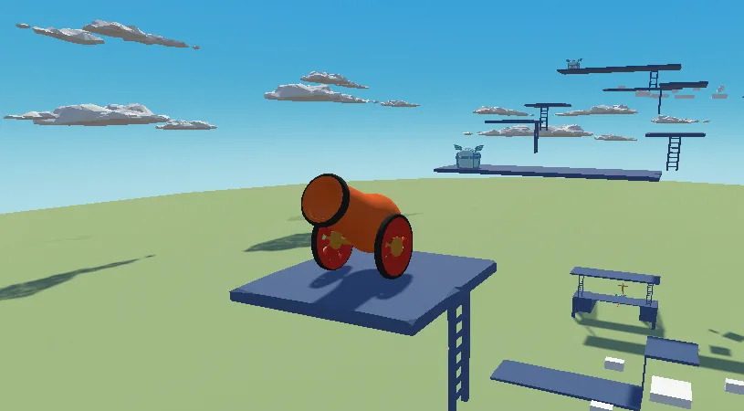

# SandBox 3D

## 개요

이 게임은 Unity 3D 환경에 적응하기 위해 만든 게임으로 3D 캐릭터에 들어가는 RigidBody, Collider, RayCast 등과 같은 기능들을 사용해 사물을 인식하고 물리작용을 커스텀하여 ‘온리 업’이란 게임과 비슷하게 제작하였다.

## 플레이어 주요기능

플레이어는 다양한 이동기능을 가지고 있는데 걷기, 뛰기, 점프, 더블점프 (아이템 사용 시), 쪼그려 앉기가 있다. 플레이어는 상자와 상호작용을 하여 랜덤으로 아이템을 얻을 수 있고 사다리와 상호작용을 하여 오를 수 있으며 발사대와 상호작용을 하여 원하는 방향으로 플레이어 캐릭터를 발사할 수 있다.

## 아이템

아이템은 총 4가지로 당근, 커피, 마늘, 사과가 있다. 아이템마다 특별한 효과가 있는데 사과를 먹을 시 체력을 25 회복을 하고 커피를 마시면 10초동안 스태미나가 무한이다. 또한 마늘은 10초동안 무적이며 당근을 먹을 시 더블 점프를 10초동안 할 수 있다.

## 환경요소

맵에는 여러가지 환경요소 및 트랩이 있다. 첫번째로 게임이 시작될 때 움직이기 시작하는 플랫폼이 존재한다. 두번째로 레이저 트랩이 있는데 레이저가 플레이어 캐릭터를 감지할 시 밟을 수 있는 플랫폼이 양쪽으로 멀어지는 방향으로 열리면서 플레이어 캐릭터를 떨어트린다. 세번째로 플레이어를 향해 돌진하는 적인데 구현하려 했으나 시간이 없어 못했다.

## License

위 프로젝트에 사용한 에셋은 [itch.io](http://itch.io) 혹은 Unity Asset Store를 통해 무료로 구매한 Asset이다.

플레이어 캐릭터 Ragdoll은 [itch.io](http://itch.io)에서 구매한 것으로 “CC0” License를 가지고 있다. 대부분의 플랫폼 및 환경요소는 Unity Asset Store를 통해 가져온 것으로 “Standard Unity Asset Store EULA” License를 가지고 있다.

발사대 디자인
https://assetstore.unity.com/packages/3d/props/weapons/stylish-cannon-pack-174145

아이템 박스
https://assetstore.unity.com/packages/3d/props/poly-style-fantasy-treasure-chest-280107

플레이어 캐릭터 디자인 및 애니메이션
https://assetstore.unity.com/packages/essentials/tutorial-projects/starter-pack-synty-polygon-stylized-low-poly-3d-art-156819

Serialized Dictionary
https://assetstore.unity.com/packages/tools/utilities/serialized-dictionary-243052